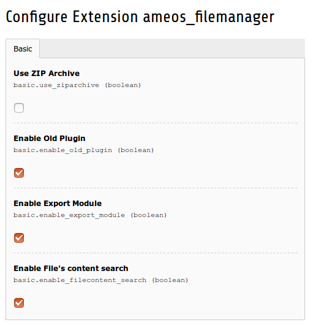

Extension configuration
=======================

You can update the configuration in the extension manager

+----------------------------------------------------+-------------------------------------------------------------------------------+
| Field                                              | Description                                                                   |
+====================================================+===============================================================================+
| Use ZIP Archive                                    | For download a folder, you can use ZipArchive library instead of zip command. |
+----------------------------------------------------+-------------------------------------------------------------------------------+
| Enable Old Plugin                                  | Enable old plugin inclusion.                                                  |
+----------------------------------------------------+-------------------------------------------------------------------------------+ 
| Enable Export Module                               | Enable a backend module for export number of download of each files.          |
+----------------------------------------------------+-------------------------------------------------------------------------------+ 
| Enable File's content search                       | Enable searching in file's content.                                           |
+----------------------------------------------------+-------------------------------------------------------------------------------+
