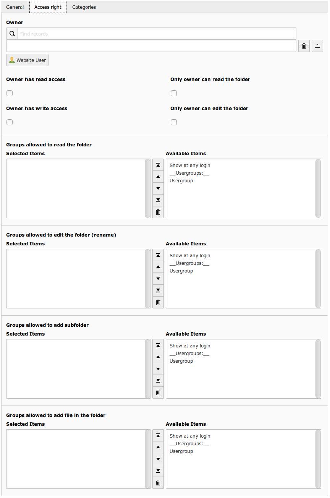
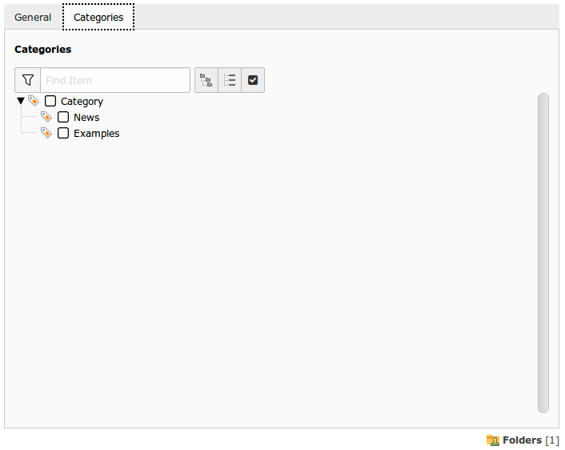

Folder configuration
====================

.. warning ::

    If folder rights are empty, it means that everyone has the given right. Therefore, you should always have a limitation set on write permissions. Otherwise, everyone might be able to edit your documents/folders.

You can edit folders in the backend file list.

Edition form is composed by two tabs :

**General Tab** 

.. figure:: ../Screenshots/FolderGeneral.png
	:alt: General Configuration

+----------------------------------------------------+-------------------------------------------------------------------------------+
| Field                                              | Description                                                                   |
+====================================================+===============================================================================+
| Description                                        | Folder's description.                                                         |
+----------------------------------------------------+-------------------------------------------------------------------------------+
| Keywords                                           | Folder's keywords.                                                            |
+----------------------------------------------------+-------------------------------------------------------------------------------+
| Status                                             | Status ready or achive. If empty, inherit the parent status.                  |
+----------------------------------------------------+-------------------------------------------------------------------------------+

**Access right Tab** 

+----------------------------------------------------+-------------------------------------------------------------------------------+
| Field                                              | Description                                                                   |
+====================================================+===============================================================================+
| Owner                                              | Owner of the folder (fe_users).                                               |
+----------------------------------------------------+-------------------------------------------------------------------------------+
| Groups allowed to read the folder                  | Frontend Usergroup allow to read the folder (browse files).                   |
+----------------------------------------------------+-------------------------------------------------------------------------------+ 
| Owner has read access                              | If checked, owner has read access to his folder.                              |
+----------------------------------------------------+-------------------------------------------------------------------------------+ 
| Only owner can read the folder                     | If checked, only the owner has access to the folder.                          |
+----------------------------------------------------+-------------------------------------------------------------------------------+
| Groups allowed to edit the folder (rename)         | Frontend Usergroup allow to rename the folder                                 |
+----------------------------------------------------+-------------------------------------------------------------------------------+
| Owner has write access                             | If checked, owner has write access to his folder.                             |
+----------------------------------------------------+-------------------------------------------------------------------------------+
| Only owner can edit the folder                     | If checked, only the owner has write access to his folder.                    |
+----------------------------------------------------+-------------------------------------------------------------------------------+
| Groups allowed to add subfolder                    | Frontend Usergroup allow to add subfolder.                                    |
+----------------------------------------------------+-------------------------------------------------------------------------------+
| Groups allowed to add file in the folder           | Frontend Usergroup allow to upload files in the folder.                       |
+----------------------------------------------------+-------------------------------------------------------------------------------+

**Categories Tab**

On this tab, you can associate categories with the folder.
