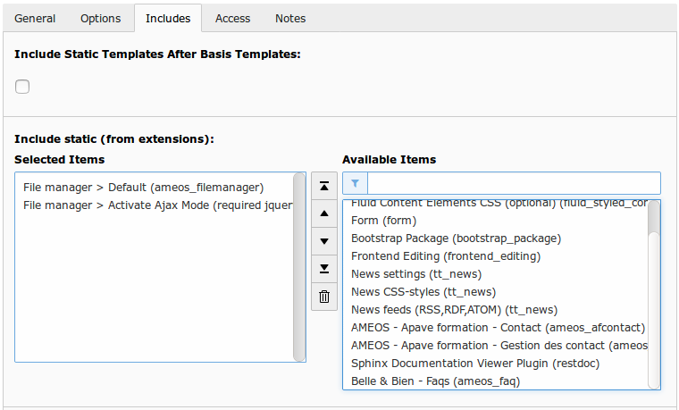

Installation
==========================

ameos_filemanager needs a little more than a simple installation.

Typoscript inclusion
----------------------

ameos_filemanager need to include Static TypoScript for run properly.

There are two static template

 * File Manager > Default : this one is mandatory

Initialization
----------------------

You must launch the update script in order to initiate the database.
This will parse the folders in your filelist and make the necessary adjustement in the database. (create folders, link sys_file to folders).

.. warning ::

    If your filelist is big and your max_execution_time low. The update script might not have time to process the entire filelist.

Once the initiation is over, you can place the plugin "Frontend File Manager" in any page of your website.

Typoscript Configuration
------------------------

Many typoscript constants are available :

+---------------------------------------------------------------+---------------------------------------------------------------------------------------------------------------------------------------------------------------------------------+
| Option                                                        | Informations                                                                                                                                                                    |
+===============================================================+=================================================================================================================================================================================+
| plugin.tx_ameosfilemanager.iconFolder                         | Icon folder path. The icon's file must have a name with the pattern : icon_(file_extension).png                                                                                 |
+---------------------------------------------------------------+---------------------------------------------------------------------------------------------------------------------------------------------------------------------------------+
| plugin.tx_ameosfilemanager.parseFolderInFE                    | If value is 1 : the files are indexed when browsing folders (FE side). Use it if file can be uploaded without ameos_filemanager or the backend filelist. E.g. Upload by FTP     |
+---------------------------------------------------------------+---------------------------------------------------------------------------------------------------------------------------------------------------------------------------------+
| plugin.tx_ameosfilemanager.allowedFileExtension               | File extension allowed for upload. E.g. jpg,jpeg,tif,png,gif,pdf,docx,doc,xls,xlsx,csv,odt,ppt,ods,pptx                                                                         |
+---------------------------------------------------------------+---------------------------------------------------------------------------------------------------------------------------------------------------------------------------------+
| plugin.tx_ameosfilemanager.newFile.owner_has_read_access      | If value is 1 : when user upload a file, he has the read access                                                                                                                 |
+---------------------------------------------------------------+---------------------------------------------------------------------------------------------------------------------------------------------------------------------------------+
| plugin.tx_ameosfilemanager.newFile.owner_has_write_access     | If value is 1 : when user upload a file, he has the write access                                                                                                                |
+---------------------------------------------------------------+---------------------------------------------------------------------------------------------------------------------------------------------------------------------------------+
| plugin.tx_ameosfilemanager.newFolder.owner_has_read_access    | If value is 1 : when user create a folder, he has the read access                                                                                                               |
+---------------------------------------------------------------+---------------------------------------------------------------------------------------------------------------------------------------------------------------------------------+
| plugin.tx_ameosfilemanager.newFolder.owner_has_write_access   | If value is 1 : when user create a folder, he has the write access                                                                                                              |
+---------------------------------------------------------------+---------------------------------------------------------------------------------------------------------------------------------------------------------------------------------+
| plugin.tx_ameosfilemanager.stockageGroupPid                   | Storage folder that contains usergroups                                                                                                                                         |
+---------------------------------------------------------------+---------------------------------------------------------------------------------------------------------------------------------------------------------------------------------+
| plugin.tx_ameosfilemanager.includejQuery                      | If value is 1 : include jQuery in the website                                                                                                                                   |
+---------------------------------------------------------------+---------------------------------------------------------------------------------------------------------------------------------------------------------------------------------+
| plugin.tx_ameosfilemanager.includeFontawesome                 | If value is 1 : include fontawesome in the website                                                                                                                              |
+---------------------------------------------------------------+---------------------------------------------------------------------------------------------------------------------------------------------------------------------------------+
| plugin.tx_ameosfilemanager.includeDefaultCss                  | If value is 1 : include default ameos_filemanager css file                                                                                                                      |    
+---------------------------------------------------------------+---------------------------------------------------------------------------------------------------------------------------------------------------------------------------------+
