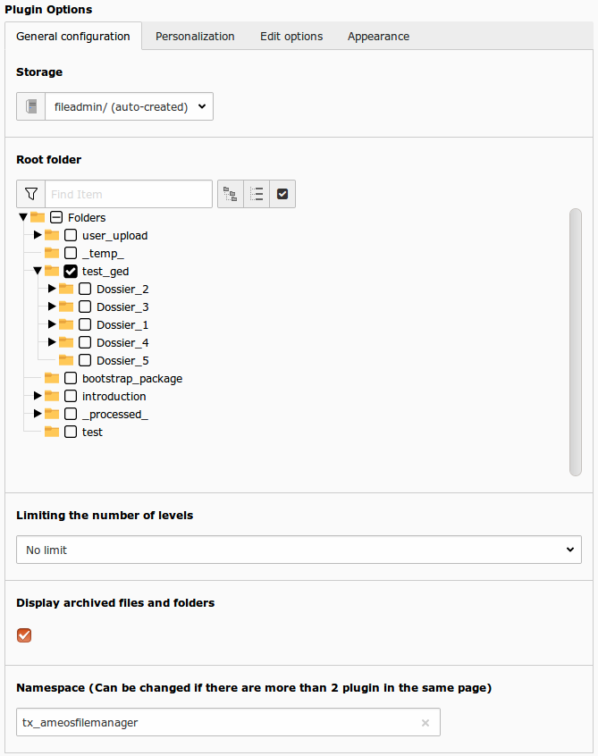
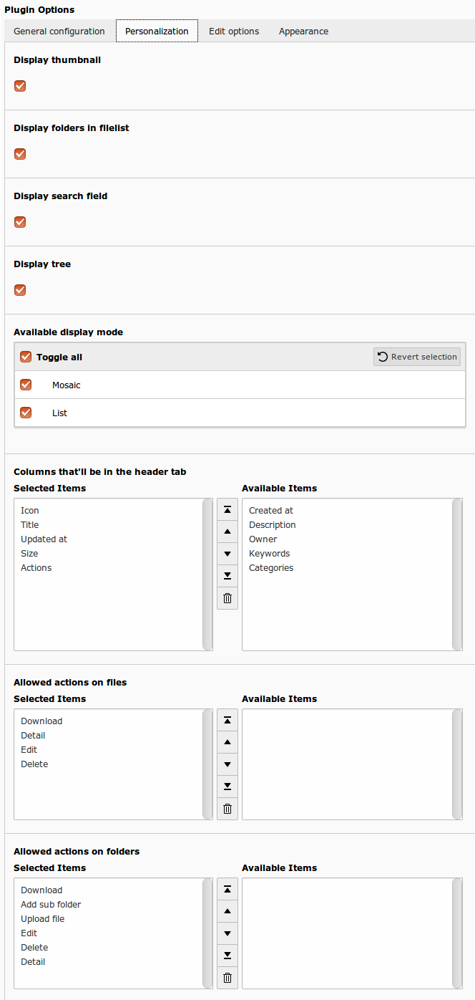
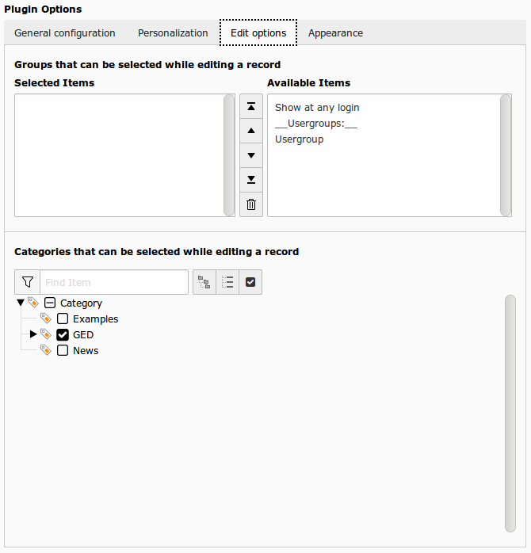
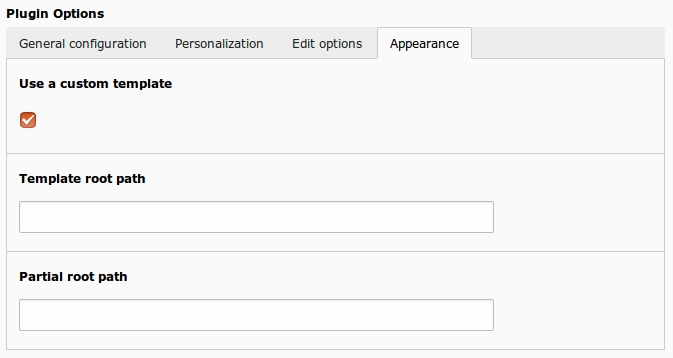

Plugin configuration
====================

General configuration
----------------------

    
This is the basic configuration you need to make your extension to work.

+----------------------------------------------------+-------------------------------------------------------------------------------+
| Option                                             | Detail                                                                        |
+====================================================+===============================================================================+
| Storage                                            | Storage mount where your files are.                                           |
+----------------------------------------------------+-------------------------------------------------------------------------------+
| Root folder                                        | Root folder for the plugin.                                                   |
+----------------------------------------------------+-------------------------------------------------------------------------------+ 
| Limiting the number of levels                      | Limite the recursion from the root fodler.                                    |
+----------------------------------------------------+-------------------------------------------------------------------------------+
| Display Archive                                    | If check, archive files are displayed.                                        |
+----------------------------------------------------+-------------------------------------------------------------------------------+
| Namespace                                          | Change only if you have 2 plugins on the same page. This avoids the conflicts |
+----------------------------------------------------+-------------------------------------------------------------------------------+

Personalization
----------------------

    
These options are for display purpose only, you may let the default settings or choose your own :

+-------------------------------------------+------------------------------------------------------------------------------------------------------------------------------------------+
| Option                                    | Detail                                                                                                                                   |
+===========================================+==========================================================================================================================================+
| Display thumbnail                         | If checked, thumbnails are displayed instead of filetype's icon                                                                          |
+-------------------------------------------+------------------------------------------------------------------------------------------------------------------------------------------+
| Display folders in filelist               | If checked, folders are displayed if the list of files                                                                                   |
+-------------------------------------------+------------------------------------------------------------------------------------------------------------------------------------------+
| Display search field                      | If checked, search field is available                                                                                                    |
+-------------------------------------------+------------------------------------------------------------------------------------------------------------------------------------------+
| Display tree                              | If checked, a folder tree is available                                                                                                   |
+-------------------------------------------+------------------------------------------------------------------------------------------------------------------------------------------+
| Available display mode                    | Display mode of the file list. List or mosaic. If both are checked, a dropdown menu is displayed. The user can choose the display mode.  |
+-------------------------------------------+------------------------------------------------------------------------------------------------------------------------------------------+
| Columns that'll be in the header tab      | If display mode list is available, configure the information that will be displayed                                                      |
+-------------------------------------------+------------------------------------------------------------------------------------------------------------------------------------------+
| Allowed actions on files                  | Actions availables for the files                                                                                                         |
+-------------------------------------------+------------------------------------------------------------------------------------------------------------------------------------------+
| Allowed actions on folders                | Actions availables for the fodlers                                                                                                       |
+-------------------------------------------+------------------------------------------------------------------------------------------------------------------------------------------+

Edit options
----------------------

    
These are the options used to build the frontend form to add/edit files and folders

+--------------------------------------------------------+---------------------------------------------------------------------------------------------------------------------+
| Option                                                 | Detail                                                                                                              |
+========================================================+=====================================================================================================================+
| Groups that can be selected while editing a record     | List of selectionable groups in FE forms. You can use this option to prevent FE admin to give rights to any group.  |
+--------------------------------------------------------+---------------------------------------------------------------------------------------------------------------------+
| Categories that can be selected while editing a record | List of selectionable groups in FE forms. You can use this option to prevent FE admin to give rights to any group.  |
+--------------------------------------------------------+---------------------------------------------------------------------------------------------------------------------+

Apparence
----------------------

These are the options for set a custom template

+------------------------------------+----------------------------------------------------------------------------------------------------------------------+
| Option                             | Detail                                                                                                               |
+====================================+======================================================================================================================+
| Use custom template                | If checked, you can set a custom template root path and a custom partial root path                                   |
+------------------------------------+----------------------------------------------------------------------------------------------------------------------+
| Template root path                 | If you want, you can set your own template : set here, your template root path. If empty, default template is used   |
+------------------------------------+----------------------------------------------------------------------------------------------------------------------+
| Partial root path                  | If you want, you can set your own template : set here, your partial root path. If empty, default template is used    |
+----------------------------------------------------+----------------------------------------------------------------------------------------------------------------------+
