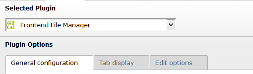
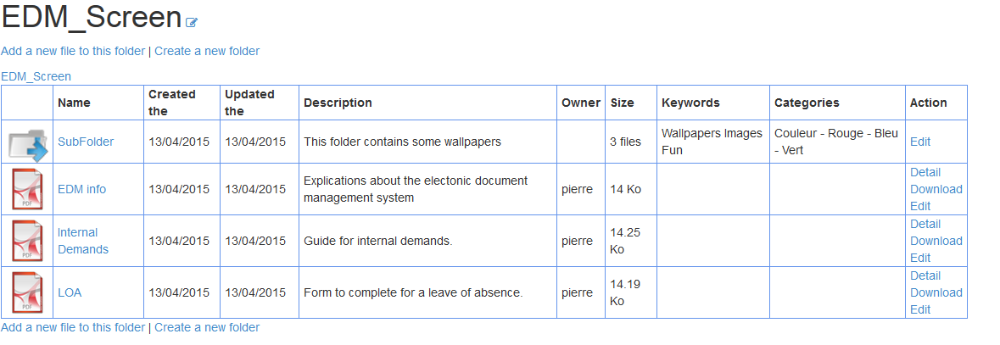

Introduction
============

.. _what-it-does:

What does it do?
----------------

This extension allow users to handle documents in the frontend context. You can set up read and write rights according to frontend groups.
Filemanager uses FAL, that way, you'll be sure to have a similarity between what's in the frontend context and the filelist in the BE.
There is also a search plugin available to search a special file.
An export plugin is also available. It'll export how many time each file has been downloaded.
Please consult the :ref:`User manual <usermanual>` for additional information.

.. _warning:

Warning
--------------

The files and folders are the same in FE and BE. Therefore, a change in one context will be applied in the other.

.. _screenshots:

Screenshots
-----------

	In these tabs you'll be able to choose how your plugin will be display and what it'll display. More information about this can be fount in the :ref:`Administration manual <adminmanual>`

	This is how the extension will look like if you select all tab items. :ref:`(See administration manual) <adminmanual>`
