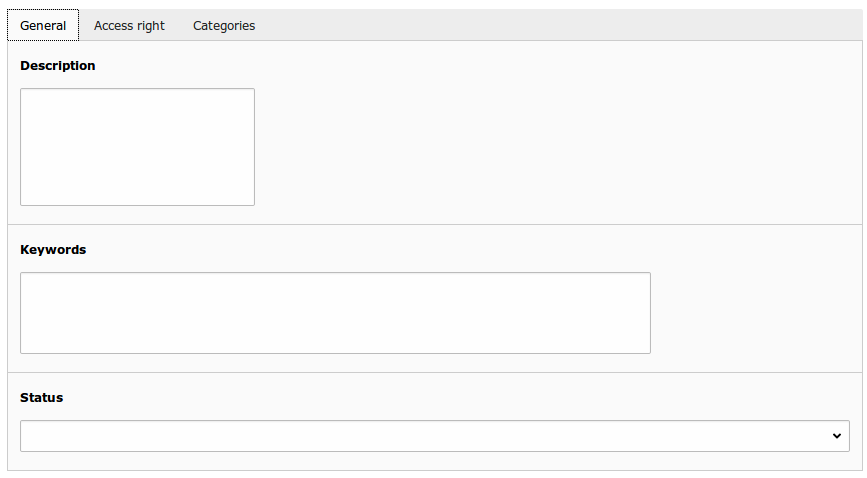

File configuration
====================

.. warning ::

    If a file has no rights set, his rights will be the same as his parent folder.

You can edit files in the backend file list.

Ameos FileManager add EDM Tab

+----------------------------------------------------+-------------------------------------------------------------------------------+
| Field                                              | Description                                                                   |
+====================================================+===============================================================================+
| Owner                                              | Owner of the folder (fe_users).                                               |
+----------------------------------------------------+-------------------------------------------------------------------------------+
| Groups allowed to read the folder                  | Frontend Usergroup allow to read the folder (browse files).                   |
+----------------------------------------------------+-------------------------------------------------------------------------------+ 
| Owner has read access                              | If checked, owner has read access to his folder.                              |
+----------------------------------------------------+-------------------------------------------------------------------------------+ 
| Only owner can read the folder                     | If checked, only the owner has access to the folder.                          |
+----------------------------------------------------+-------------------------------------------------------------------------------+
| Groups allowed to edit the folder (rename)         | Frontend Usergroup allow to rename the folder                                 |
+----------------------------------------------------+-------------------------------------------------------------------------------+
| Owner has write access                             | If checked, owner has write access to his folder.                             |
+----------------------------------------------------+-------------------------------------------------------------------------------+
| Only owner can edit the folder                     | If checked, only the owner has write access to his folder.                    |
+----------------------------------------------------+-------------------------------------------------------------------------------+
| Groups allowed to add subfolder                    | Frontend Usergroup allow to add subfolder.                                    |
+----------------------------------------------------+-------------------------------------------------------------------------------+
| Groups allowed to add file in the folder           | Frontend Usergroup allow to upload files in the folder.                       |
+----------------------------------------------------+-------------------------------------------------------------------------------+
| Status                                             | Status ready or achive. If empty, inherit the folder status.                  |
+----------------------------------------------------+-------------------------------------------------------------------------------+
