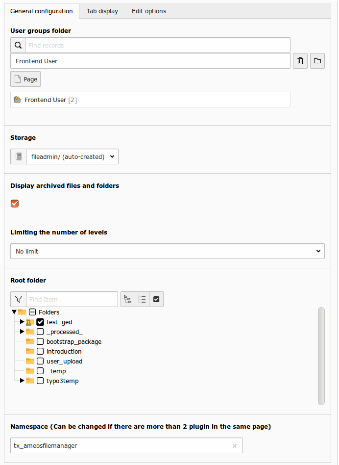
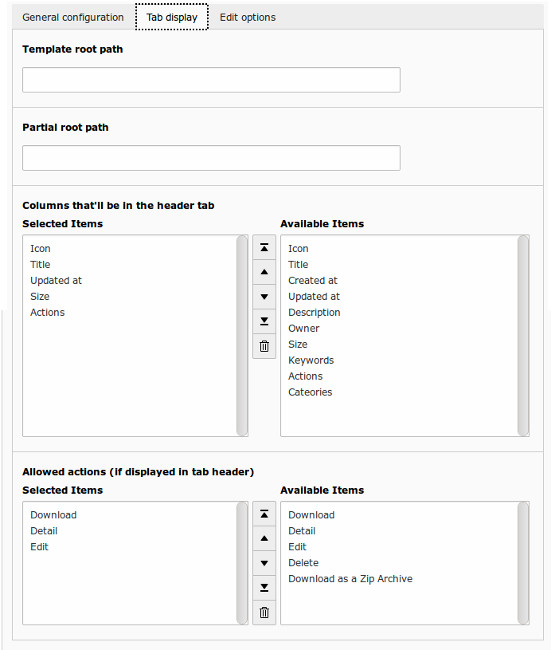
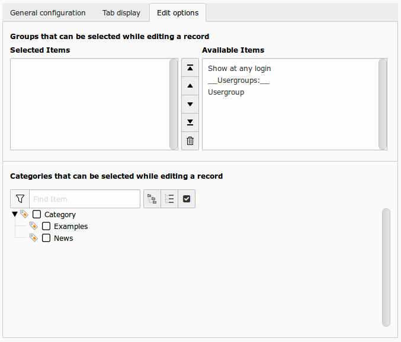

Plugin configuration
====================

General configuration
----------------------

    
This is the basic configuration you need to make your extension to work.

+----------------------------------------------------+-------------------------------------------------------------------------------+
| Option                                             | Detail                                                                        |
+====================================================+===============================================================================+
| User groups folder                                 | Folder where you usergroups are stored.                                       |
+----------------------------------------------------+-------------------------------------------------------------------------------+
| Storage                                            | Storage mount where your files are.                                           |
+----------------------------------------------------+-------------------------------------------------------------------------------+
| Display Archive                                    | If check, archive files are displayed.                                        |
+----------------------------------------------------+-------------------------------------------------------------------------------+
| Limiting the number of levels                      | Limite the recursion from the root fodler.                                    |
+----------------------------------------------------+-------------------------------------------------------------------------------+ 
| Root folder                                        | Root folder for the plugin.                                                   |
+----------------------------------------------------+-------------------------------------------------------------------------------+ 
| Namespace                                          | Change only if you have 2 plugins on the same page. This avoids the conflicts |
+----------------------------------------------------+-------------------------------------------------------------------------------+

Tab display
----------------------

    
These options are for display purpose only, you may let the default settings or choose your own :

+----------------------------------------------------+----------------------------------------------------------------------------------------------------------------------+
| Option                                             | Detail                                                                                                               |
+====================================================+======================================================================================================================+
| Template root path                                 | If you want, you can set your own template : set here, your template root path. If empty, default template is used   |
+----------------------------------------------------+----------------------------------------------------------------------------------------------------------------------+
| Partial root path                                  | If you want, you can set your own template : set here, your partial root path. If empty, default template is used    |
+----------------------------------------------------+----------------------------------------------------------------------------------------------------------------------+
| Allowed actions (if displayed in tab header)       | If action was selected in the displayed columns, you can choose which one will appear in the selected box.           |
|                                                    | Note that if not selected, download will still be available via links on the file title and icon.                    |
+----------------------------------------------------+----------------------------------------------------------------------------------------------------------------------+
| Columns                                            | You can configure the information that will be displayed for files and folders                                       |
+----------------------------------------------------+----------------------------------------------------------------------------------------------------------------------+

Edit options
----------------------

    
These are the options used to build the frontend form to add/edit files and folders

+--------------------------------------------------------+---------------------------------------------------------------------------------------------------------------------+
| Option                                                 | Detail                                                                                                              |
+========================================================+=====================================================================================================================+
| Groups that can be selected while editing a record     | List of selectionable groups in FE forms. You can use this option to prevent FE admin to give rights to any group.  |
+--------------------------------------------------------+---------------------------------------------------------------------------------------------------------------------+
| Categories that can be selected while editing a record | List of selectionable groups in FE forms. You can use this option to prevent FE admin to give rights to any group.  |
+--------------------------------------------------------+---------------------------------------------------------------------------------------------------------------------+

Other plugins
--------------

There are two others plugins

 * Search : plugin to allow search via a text field
 * Flat list : display all files of a folder in a flat list (includes subfolders files)
