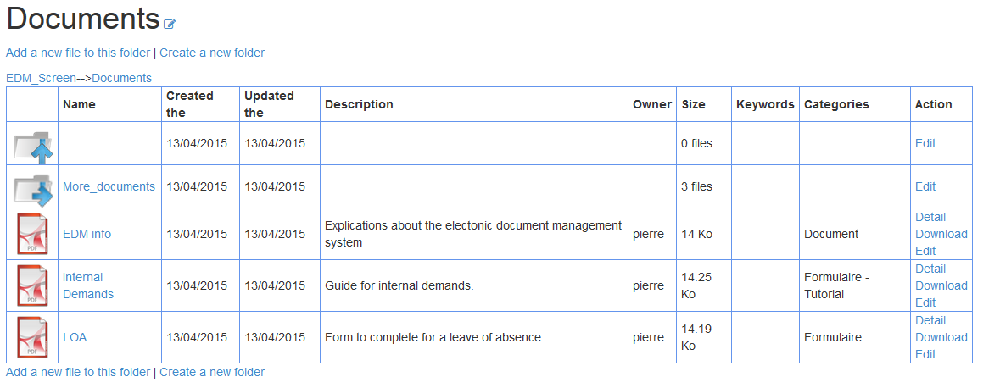

FE - Browsing through folder
=============================

ameos_filemanger provides a simple way to browse through folders.
The default folder is the one indicated in the BE configuration. :ref:`(See administration manual) <adminmanual>`
Users will see what's in the default folder when they arrive on the plugin page.

They will then be able to visit the different folder to which they have access.

From this tab, the user will be able to (depending on his rights) :
	- Navigate folder
	- Edit folders
	- Edit files
	- Download files
	- Create files
	- Create folders

As you can see on the screenshot, there is a breadcrumb that'll allow faster navigation for the user.