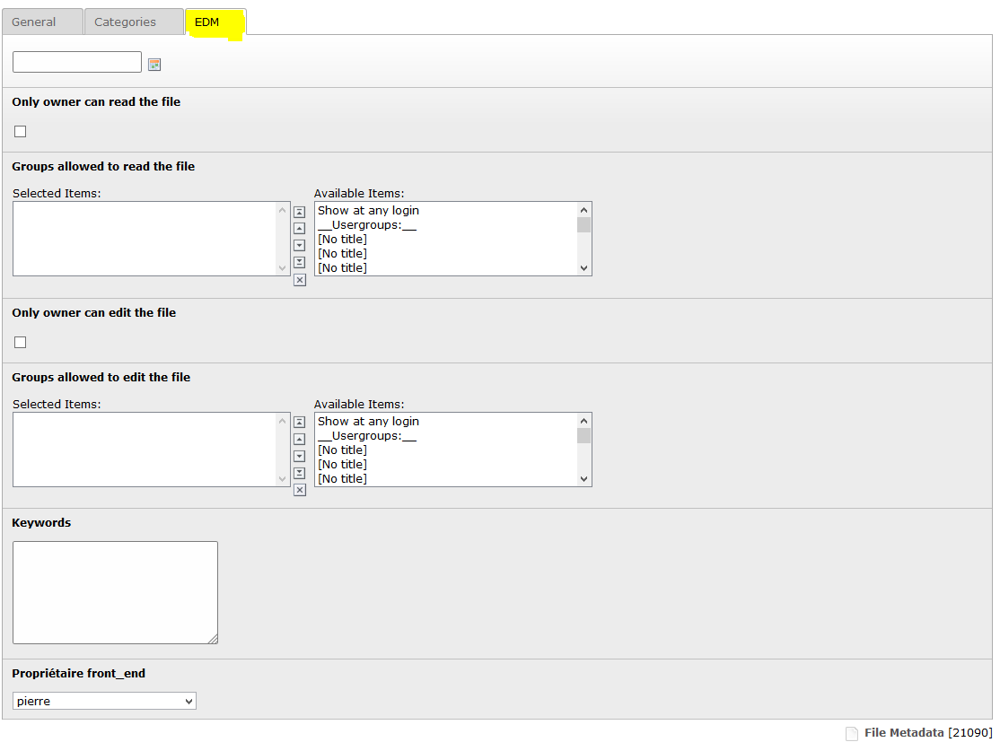

Manages files
==========================

FE management
--------------

From the frontend,
a user with proper rights can edit or add files in certain folder.

If he has that right, links will automatically appear.
To add a new file, simply click on to corresponding link either above or underneath the tab.

.. figure:: ../Images/addFile.png
	:alt: FE - Form add file

The edition form is strictly the same. Only, inputs will be filed with file info.
You'll also have (if possible) a view of the current file and a link the download the current file.

BE management
--------------

From the backend,
you can add/edit files via the filelist. A new tab has appeared allowing to handle the new metadatas of the files.

