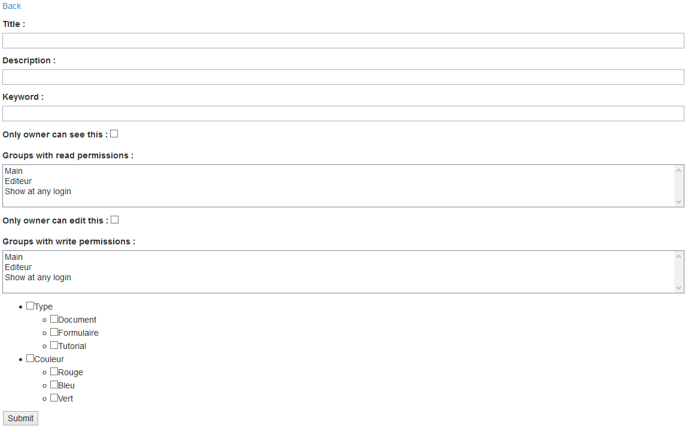

Manage folders
==========================

FE management
--------------

From the frontend,
a user with proper rights can edit or add folders.

If he has that right, edit links will automatically appear.
To add a new folder, simply click on to the corresponding link either above or underneath the tab.

The edition form is strictly the same. Only, inputs will be filled with folder info.

BE management
--------------

From the backend,
you can add/edit folders via the filelist. Folder properties can be modified via folder metadatas.